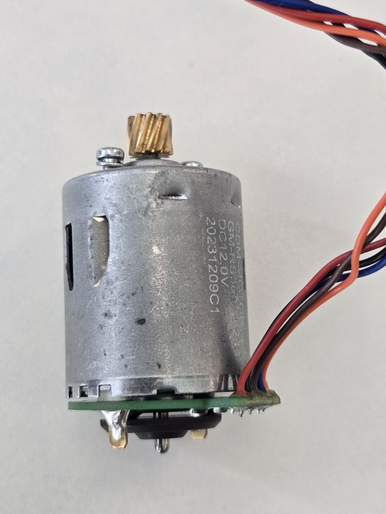
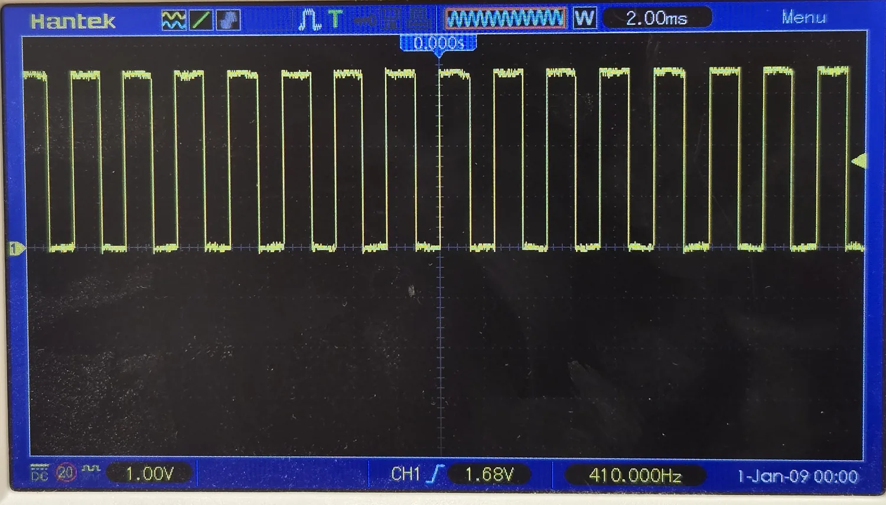

# Drive wheel module — motor, encoder, gearbox and wheel-drop sensor

Spec sheet for the aftermarket Roborock S5 Max–family drive wheel module, measured on a
physical unit. Covers the electrical side (motor + Hall encoder wiring, verified pinout)
and the mechanical side that odometry depends on (gear teeth counted, encoder edges per
revolution, mm per edge).

Everything marked **VERIFIED** was measured by me on the unit described under
*Provenance*. Everything else is flagged as estimated, inherited from generic family data,
or open.

## Provenance

| Field | Value |
|---|---|
| Part | Drive wheel module (left/right pair), aftermarket replacement |
| Advertised compatibility | Roborock S5 Max / S6 MaxV / S6 Pure / S7 Pro / E4 |
| Vendor | AliExpress — [listing 1005007359089056](https://es.aliexpress.com/item/1005007359089056.html) |
| Unit tested | One module, disassembled |
| Motor can markings | `CDM-MOTOR` / `GM-RS360-16248` / `DC 12.0V` / `20231209C1` |
| Measured by | [@IKsares](https://github.com/IKsares), July–August 2026 |
| Instruments | Digital multimeter, bench supply, calipers, scale, Hantek DSO5202P oscilloscope |

> ⚠️ **This is an aftermarket module, not an OEM Roborock teardown.** The motor fitted here
> is a CDM `GM-RS360-16248`. An OEM module, or another aftermarket batch, may ship a
> different motor or a different wire colour code. Check the can markings against yours
> before trusting the pinout below.

## 1. Motor identification

| Field | Value | Status |
|---|---|---|
| Manufacturer | CDM (Chinese OEM) | from can marking |
| Model | `GM-RS360-16248` | from can marking |
| Frame family | RS-360 class | inferred from format |
| Type | Brushed DC, permanent magnet | VERIFIED |
| Rated voltage | 12 V DC | from can marking |
| Feedback | Single-channel Hall sensor on a rear-cap PCB, reading a magnetic ring on the shaft | VERIFIED |
| Mechanical output | Metal pinion on the front shaft (11 teeth) | VERIFIED |
| Interconnect | 5-wire pigtail soldered to the rear PCB | VERIFIED |
| Datasheet | **None published** for this variant | — |

`20231209C1` fits a date/lot code pattern (2023-12-09, lot C1); not confirmed by the
manufacturer.

Generic RS-360 family figures circulated by distributors — ≈12 000 rpm no-load at 12 V,
3–10 W, ≈52 g, 6–24 V operating range, can ≈Ø27 mm × ≈50 mm long — are **order-of-magnitude
only**. They were not measured on this unit and should not be quoted as the part's
specification, nor used as CAD dimensions.

### Physical dimensions and mass — VERIFIED

Calipers on the motor with its rear Hall PCB fitted and the pinion pressed on, as pictured.

| Dimension | Value | Taken |
|---|---|---|
| Can diameter | **27.5 mm** | across the cylinder, clear of the seam |
| Length, rear PCB to front face | **34.0 mm** | shaft excluded |
| Shaft protrusion | **10.3 mm** | front face to tip |
| **Overall axial envelope** | **44.3 mm** | 34.0 + 10.3 |
| Shaft diameter | **2.20 mm** | |
| Mass | **66 g** | motor, rear PCB and 220 mm pigtail — *not* the complete wheel module |



**The diameter confirms the frame family; the circulated length does not describe this unit.**
27.5 mm sits on the RS-360 nominal 27.7 mm, so reading the frame class off the can marking
holds up. But the ≈50 mm length quoted for the family is 16 mm longer than this entire motor
measured *including* its rear PCB — this is a short-can variant. The ≈52 g family figure misses
in the other direction, against 66 g here (which does include the PCB and the pigtail). Of the
three family dimensions that can now be checked against this unit, **one holds and two do not**
— a concrete example of why the figures above must not be lifted into CAD.

> **The rear face is not flat.** The magnetic ring carrier and the solder tabs stand proud of
> the PCB by a few millimetres (visible in the photo). The 34.0 mm is measured to the PCB, so
> the true rear envelope is somewhat longer. A housing design needs that clearance measured
> before it can be trusted (§9).

### Winding resistance and stall current — VERIFIED

Measured with the **rotor locked**, on the motor leads, driving a known current from a
current-limited bench supply and reading the terminal voltage. Three operating points:

| Current | Terminal voltage |
|---|---|
| 0.27 A | 3.30 V |
| 0.50 A | 4.43 V |
| 1.00 A | 7.00 V |

A brushed motor is not a pure resistor: the brush-to-commutator contact drops a roughly
**constant** voltage that does not scale with current. Fitting `V = V₀ + I·R` by least squares:

| Parameter | Value |
|---|---|
| **Winding resistance R** | **5.08 Ω** |
| **Brush contact drop V₀** | **1.91 V** |
| Fit residuals | < 25 mV at all three points |

The fit is linear across the whole measured range, so the split between winding and brush drop
is a real feature of the motor, not an artefact of two points.

> ⚠️ **Do not compute stall current as V/R from a low-current measurement.** The naive
> quotient at 0.5 A gives an apparent 8.86 Ω, because it charges the fixed ~1.9 V brush drop as
> if it were resistance. That **underestimates stall current by about 60%** — exactly the kind
> of error that leaves an H-bridge undersized.

Stall current, `I = (V − V₀) / R`:

| Supply | Stall current |
|---|---|
| 12 V | 1.99 A |
| 14.4 V (4S nominal) | 2.46 A |
| **16.8 V (4S fully charged — worst case)** | **2.93 A** |

**Upper bound, model-independent:** even if the brush drop vanished entirely at high current,
Ohm's law alone caps the draw at 16.8 / 5.08 = **3.31 A**. This motor cannot ask for more than
that on a fully charged 4S pack, whatever the brushes do.

That matters for the driver choice: the DRV8870 / TMI8870 on the reference I/O board is rated
3.6 A peak, so it clears the worst case — by 23% on the fitted figure, 9% on the hard upper
bound. The `SPEC.md` placeholder of "3.5 A (TODO — needs verification)" turns out to have been
a good guess.

**Caveats.** Measured cold; copper gains roughly 25% resistance at 80 °C, so a hot motor draws
*less* — the figures above are the conservative end. Stall is extrapolated 3× beyond the
highest measured point. And these were taken at **one rotor position**: with few commutator
segments the resistance varies with shaft angle, and the minimum-resistance position is the one
that sets the true peak. That sweep is still open (§9), and it is the only thing that could
push this motor past the driver's rating.

### No-load current — VERIFIED

**0.13 A at 12 V**, shaft free, motor out of the gearbox.

That is 1.56 W drawn at no load. Splitting it with the constants above:

| Term | Value |
|---|---|
| Copper loss `I²R` | 0.09 W |
| Brush drop loss `I·V₀` | 0.25 W |
| **Mechanical + iron losses** | **≈1.23 W** (bearings, brush friction, core) |
| Back-EMF at no-load speed | ≈9.4 V |

Stall-to-no-load current ratio ≈ 15, normal for a small brushed motor in good condition — a
worn or binding unit would show a higher no-load draw.

> The back-EMF figure extrapolates the brush drop *below* the measured range (the fit spans
> 0.27–1 A). Brush drop tends to fall at low current, so the real back-EMF is 9.4 V or a little
> more, and the mechanical losses correspondingly a little higher.

**One measurement closes the motor model.** With the no-load *speed*, back-EMF gives the motor
constant `Ke = Kt`, and from there stall torque, wheel torque through the 65.36 : 1 train, and
the full torque-speed curve — all of which `part-specs` asks for and none of which is
established for this part. And the speed is measurable without a tachometer: the encoder puts
out 4 cycles per motor revolution (§4), so **a multimeter's frequency range on the blue wire
gives `rpm = f/4 × 60`** while the motor spins at 12 V. The Hall needs its own 3.3 V supply
with grounds tied — a couple of AA cells will do it. **Do not feed the Hall from the 12 V
motor rail** (§6).

> **An ohmmeter will not reproduce these numbers — don't try to check them that way.** At the
> sub-milliamp test current of a multimeter's resistance range, the reading is dominated by the
> brush-to-commutator contact and its oxide film, not by the copper. On this motor an ohmmeter
> gave anything from 14 Ω to over 100 Ω depending on shaft angle and on the moment, and was not
> repeatable: a later sweep bottomed out at 20 Ω where an earlier static reading had given 14 Ω.
> None of that reflects the winding. Drive a known current and read the terminal voltage, as
> above. The ohmmeter is good only for confirming the order of magnitude — which it does: tens
> of ohms apparent, not single digits, is what rules out the shaft having been spinning.

## 2. Wiring — VERIFIED

Five wires leave the rear PCB. Two are the motor winding, three are the Hall sensor.

| Wire colour | Function | Notes |
|---|---|---|
| red | motor terminal 1 | polarity only sets rotation direction |
| black | motor terminal 2 | interchangeable with red |
| orange | Hall sensor **VCC** | verified working at 3.3 V, ≈2.5 mA |
| brown | Hall sensor **GND** | sensor reference |
| blue | Hall sensor **OUT** | **open collector — external pull-up required**; swings 0 V ↔ VCC with one |

> ⚠️ **Colour-code warning.** The sensor wiring does **not** follow the common industrial
> convention (brown = +, blue = 0 V). On this unit **brown is GND and orange is VCC**.
> Any harness, schematic or assembly instruction must state this explicitly — wiring it
> "the usual way" reverses the sensor supply.

The PCB silkscreen reads `红 黑 棕 蓝 橙` (red, black, brown, blue, orange) next to the five
solder pads. It labels only the **wire colour** expected at each pad — it does not document
the signal function. The pad order on the board is therefore red, black, brown, blue,
orange; the function mapping is the one in the table above.


The motor winding is **galvanically isolated** from the sensor circuit (no continuity
between the red/black pair and any of the three sensor wires).

### Module connector and harness — VERIFIED

All seven conductors terminate in a **single 7-way connector**.

> **Orientation reference:** pins numbered left to right **viewed from the wire side, with the
> retention latches facing up** — the view in the photo below.

| Pin | Wire | Function |
|---|---|---|
| 1 | wheel-drop switch | dry contact, no polarity |
| 2 | wheel-drop switch | dry contact, no polarity |
| 3 | orange | Hall VCC |
| 4 | blue | Hall OUT |
| 5 | brown | Hall GND |
| 6 | black | motor terminal |
| 7 | red | motor terminal |

The wheel-drop pair is at one end and the motor pair at the other, with the three Hall
conductors between them. Their colour depends on which side the module is from — see §5.

| Harness | Value |
|---|---|
| Conductors | 7 |
| **Pitch** | **1.5 mm** — measured 9.0 mm centre-to-centre from pin 1 to pin 7, ÷6 |
| **Connector family** | **JST ZH 1.5 mm**, or a pitch-compatible clone — no manufacturer marking is visible, so the pitch is what is verified, not the brand |
| **Total length** | **220 mm** |
| **Free length past the cable guide** | **155 mm** — the bundle is threaded through a moulded guide on the module, so this is the length a harness design can actually work with |


> **1.5 mm is the same pitch the I/O board already uses.** The current OOMWOO schematic
> specifies a board-side 5-pin JST ZH 1.5 mm for the wheel
> ([OsakaTX](../../OsakaTX/io-board-wheel-connector-and-caster.md), footprint
> `CONN-SMD_5P-P1.50_ZX-ZH1.5-5PWT`). The module side is the same family and pitch — the only
> mismatch is the way count, 7 vs 5, because the module brings motor power and the wheel-drop
> pair out on the same connector. This also rules out Scowt's tentative "might be XH", which
> would be 2.5 mm.

### How it was verified

1. **Power circuit.** Continuity confirmed between red/black and the two brush tabs on the
   can. The other three wires show no continuity to the tabs.
2. **Diode-mode mapping** of the three sensor wires (red probe on the first wire listed):

   | Pair | Reading |
   |---|---|
   | brown → blue | 0.43 V |
   | orange → brown | 0.957 V |
   | brown → orange | OL |
   | blue → brown | OL |
   | blue → orange | OL |
   | orange → blue | OL |

   The 0.957 V drop orange→brown corresponds to two junctions in series (series protection
   diode on the supply + internal path of the IC), identifying **orange as VCC**. Conduction
   brown→blue with no conduction at all *from* blue is consistent with **brown as ground**.
3. **Functional test.** 3.3 V applied to orange through a 220 Ω series resistor, brown to
   supply ground. Measured 2.76 V at orange → 0.54 V across the resistor → **≈2.5 mA draw**,
   consistent with a digital Hall IC. Spinning the shaft by hand, blue **toggles between
   0 V and 2.7 V** — essentially rail to rail.

One conclusion follows safely from the functional test: the sensor is operational at
**3.3 V**, which rules out the classic 4.5–24 V Hall parts (A3144 class) and points to a
modern low-voltage IC.

> ⚠️ **A second conclusion drawn here was wrong, and is corrected in §4.** The multimeter
> showed blue reaching nearly VCC with no external resistor, which was read as "no external
> pull-up is required". It is not: a multimeter's 10 MΩ input cannot tell a driven high level
> from a floating node. On a scope, **removing the pull-up leaves the blue line carrying
> nothing but noise**. The output stage is open collector and an external pull-up is
> mandatory — see §4 and requirement 2 in §6.

## 3. Gearbox — VERIFIED

Compound gear train, four reduction stages from the motor pinion to the wheel output. Teeth
counted on the opened gearbox. The motor pinion is **helical** (see below); the tooth form of
the three later stages was not recorded, so the train may be helical throughout or helical
only at the motor. Either way the tooth counts, and therefore every ratio in this section,
are unaffected.

| Stage | Driver (teeth) | Driven (teeth) | Ratio |
|---|---|---|---|
| Motor pinion → gear 1 | 11 | 36 | 3.273 |
| Gear 1 pinion → gear 2 | 13 | 42 | 3.231 |
| Gear 2 pinion → gear 3 | 12 | 34 | 2.833 |
| Gear 3 pinion → gear 4 (output) | 11 | 24 | 2.182 |

**Total reduction i = (36·42·34·24) / (11·13·12·11) = 1 233 792 / 18 876 ≈ 65.36 : 1**
(motor revolutions per wheel revolution).

### Motor pinion — tooth form and module

Brass pinion pressed onto the front shaft, 11 teeth, **visibly helical** in the photo in §1.

**Outside diameter: 7.00 mm as read, ≈7.14 mm corrected.** With an odd tooth count a caliper
cannot bridge tip to tip — it rests on one tip and on the two tips flanking the opposite gap,
reading `De·(1 + cos(180°/z))/2`, which for z = 11 is 0.980·De. The correction is +2%.

Comparing hypotheses as *what the caliper would have read*, so the same 0.980 factor applies
to all of them:

| Hypothesis | Theoretical De | Expected caliper reading |
|---|---|---|
| Spur, m = 0.5 | 6.50 mm | 6.37 mm |
| Spur, m = 0.6 | 7.80 mm | 7.64 mm |
| Helical, mn = 0.5, β = 20° | 6.85 mm | 6.71 mm |
| **Helical, mn = 0.5, β = 25°** | 7.07 mm | **6.93 mm** |
| Helical, mn = 0.5, β = 30° | 7.35 mm | 7.20 mm |

The measured 7.00 mm falls between β = 25° and β = 30°. **No standard spur module fits**:
m = 0.5 is 0.6 mm short and m = 0.6 overshoots by as much, and closing that gap with a spur
gear would require a profile shift of about +0.6 — implausible on a pinion already helical
by inspection. So the first stage is most likely **normal module 0.5 with a helix angle of
25–30°**, which lands on the measurement with no profile correction at all.

That is an inference, not a measurement: β was not measured and the mating gear was not
examined.

> **One caliper reading closes it — the first-stage centre distance** (motor shaft to the
> 36-tooth gear's shaft), since `a = mn·(z₁ + z₂) / (2·cos β)`:
>
> | | Centre distance |
> |---|---|
> | Spur, m = 0.5 | 11.75 mm |
> | Helical, mn = 0.5, β = 20° | 12.50 mm |
> | Helical, mn = 0.5, β = 25° | 12.97 mm |
> | Helical, mn = 0.5, β = 30° | 13.57 mm |
>
> The candidates are more than half a millimetre apart, so the reading discriminates cleanly.
> **With the module and helix angle fixed, all four stages in §3 become geometrically
> defined** — pitch diameters, centre distances and tooth geometry all follow from the counts
> already recorded, and the gearbox never has to be opened again to model it in CAD.

A helical first stage also means the pinion generates **axial thrust** under load, which the
motor's front bearing and any housing design have to take. A spur assumption would miss it.

## 4. Encoder resolution and odometry — VERIFIED

Base measurement: **4 rising edges per motor revolution**, i.e. 4 pulse cycles per
revolution → the magnetic ring has **4 pole pairs (8 poles)**.

**Method.** First counted by hand, turning the shaft slowly out of the gearbox while watching
the blue line toggle on a multimeter. That count was a lower bound — a multimeter cannot be
trusted not to miss a transition — so it was re-run on an oscilloscope against an index mark
on the shaft, and confirmed end to end against wheel revolutions. Both are described under
*Verified with a scope* below. The lower-bound caveat is retired.

Fixed data used below: gearbox reduction 65.36 : 1; wheel outer diameter **71.5 mm**
(measured with calipers); wheel circumference π × 71.5 = **224.6 mm**.

| Quantity | Rising edges only | Both edges (rising + falling) |
|---|---|---|
| Edges per motor revolution | 4 | 8 |
| Edges per wheel revolution | 4 × 65.36 ≈ **261.5** | 8 × 65.36 ≈ **522.9** |
| **Distance per edge** | 224.6 / 261.5 ≈ **0.859 mm** | 224.6 / 522.9 ≈ **0.430 mm** |
| Ticks per metre | ≈ **1164** | ≈ **2328** |
| Angular resolution at the wheel | ≈ 1.38° | ≈ 0.69° |

Firmware can count rising edges only (0.859 mm/edge) or both edges to double the resolution
(0.430 mm/edge) with no hardware change — but see the mark-space note below before relying on
both-edge timing for velocity.

### Verified with a scope

Rig: motor at 12.0 V; sensor at 3.3 V; **10 kΩ pull-up from blue to orange**; both supply
negatives bonded; ×10 probe with its ground clip on sensor GND; 20 MHz bandwidth limit on.

**Pole count.** With an index mark on the shaft, one full revolution produces exactly **4
complete cycles** — 4 rising and 4 falling edges. This is a direct count against a physical
reference, not an inference.

| Quantity | Value |
|---|---|
| Output swing, level to level | ≈3.35 V — essentially rail to rail at a 3.3 V supply |
| Superimposed noise | ≈0.2–0.3 V, far below the switching threshold |
| Encoder frequency, no load | **410–412 Hz** (hardware frequency counter, two captures) |
| **Motor speed, no load @ 12 V** | **6 150–6 180 rpm** |
| **Wheel speed, no load** | **≈94 rpm → ≈0.35 m/s** |
| Mark-space ratio | ≈54 % *(provisional — read off the trace; to be confirmed with the scope's automatic +Duty measurement)* |



No spurious pulses appeared over 144 ms of capture at full no-load speed, so this motor's
commutation noise does not reach the switching threshold with a 10 kΩ pull-up fitted. Behaviour
under load has not been captured.

**External pull-up is mandatory.** Removing the 10 kΩ resistor with the rest of the rig
untouched leaves the blue line carrying only noise. The output stage is open collector with no
usable on-board pull-up, correcting the conclusion originally drawn in §2 from a multimeter
reading.

**End-to-end confirmation.** At 65.36 : 1 with a 71.5 mm wheel, 410 Hz predicts 20 wheel
revolutions in 12.7 s. Timed with a stopwatch: **12.2 s and 12.8 s**. Read the other way, 20
wheel revolutions is 4492 mm, and at 410 Hz the encoder issues 5125 rising edges in 12.5 s →
**0.876 mm/edge against the 0.859 mm** derived in the table above. The 2 % gap is the
stopwatch's precision, not the model's. One measurement therefore validates the pole count,
the tooth-counted gear ratio and the distance-per-edge constant together. The alternative
2-cycles-per-revolution hypothesis predicted 6.4 s and is excluded.

> **The mark-space ratio is not 50 %, and firmware needs to know.** At ≈54 % the high sector
> spans ≈48.6° of motor rotation and the low sector ≈41.4°, so intervals between *adjacent*
> edges alternate long-short. Accumulated distance is unaffected — each pair of edges still
> sums to exactly 0.859 mm — but a velocity estimate timed between adjacent edges oscillates
> **±8 % with the shaft turning at perfectly constant speed**. Time a whole cycle instead:
> rising edge to rising edge, or edge N to edge N+2.

> **Design limitation:** single channel. This gives speed and distance, **not direction and
> not absolute position**. Direction has to be inferred from the polarity the controller
> applies to the motor. Closed-loop position control or feedback-based direction sensing
> would need a second sensor in quadrature.

## 5. Wheel-drop sensor — PARTIALLY characterized

A second sensor sits in the module's wire bundle: the wheel-drop (wheel-lift) detector that
[SPEC.md](https://github.com/makerspet/oomwoo-one-cad/blob/main/docs/SPEC.md) expects one of
per wheel.

| Field | Value | Status |
|---|---|---|
| Markings | `MG01-13` / `5P30-M55-W8W` | recorded |
| Manufacturer | Unknown — neither marking resolves to a public datasheet (OEM part) | — |
| Type | **SPDT snap-action microswitch** — three terminals, COM / NO / NC, with a lever | VERIFIED |
| Mounting | Soldered to a **small carrier PCB**, not wired directly; the two harness wires land on that PCB | confirmed |
| Carrier PCB silkscreen | **`COM`** and **`KEY1`** | read off the photo |
| Wiring | Two wires, both the same colour — **brown on the left module, grey on the right** | confirmed on both |
| Polarity | None — a dry contact, so the two wires are electrically interchangeable | — |
| **Contacts used** | **COM and NC** — the normally-closed branch. NO is left unused | VERIFIED |

### Contact behaviour — VERIFIED

| Lever | COM–NC | COM–NO | Harness (the two wires) |
|---|---|---|---|
| At rest (not pressed) | **closed** | open | **closed — continuity** |
| Pressed | open | closed | **open** |

Standard SPDT behaviour, and the module wires the **normally-closed** branch: **at rest the
two harness wires show continuity, and pressing the lever opens the circuit.** The NO terminal
is present but unused, so a design that needs the inverse sense can re-land one wire rather
than invert it in firmware.

This is consistent with `KEY1` being the pad that carries the NC contact, though the pad-to-
terminal mapping was not traced.

> **What the NC choice implies.** Wiring the normally-closed branch is the classic fail-safe
> arrangement: a broken wire, a popped connector or a corroded contact all read as *open*, the
> same as the alarm condition. For that to actually be safe, *open* must be the **wheel-dropped**
> state — which means the lever should be **pressed when the wheel drops**, not when it
> retracts. That is an inference from the design choice, not a measurement: the mechanical
> correspondence is still open below. **Firmware should treat open as wheel-dropped and stop**,
> which is the safe reading whichever way the mechanism turns out to work.

Note also that `MG01-13` may be the **carrier PCB's** designation rather than the switch model,
which would explain why neither marking resolves publicly.

**The switch wire colour encodes the side.** Both modules of the pair were checked: the left
one has the pair in brown, the right one in grey. That is worth knowing — it is the only
external marking that tells the two modules apart once they are off the robot.

It also resolves what looked like a contradiction with [Scowt](../../Scowt/DriveWheel.md),
who describes the limit switch on **two grey wires**: that matches the right-hand module.
Both descriptions are correct, for different sides.

> ⚠️ **On the left module, three brown wires carry three different functions** — the Hall
> sensor GND (§2) plus both wheel-drop switch wires. There, colour cannot identify a
> conductor: go by connector position or by continuity. The failure is silent — connecting a
> switch wire where the Hall ground belongs shorts nothing, it just leaves the sensor
> unreferenced and the encoder dead with no visible cause. The right module does not have
> this ambiguity (one brown, two grey).

### Still open

Measurable now, even with the switch out of the module (multimeter, no power):

- [ ] Contact rating, if printed on the body
- [ ] Where each marking is printed — switch body, carrier PCB, or harness

Needs the module assembled, or at least the switch offered up to its seat:

- [ ] **Which mechanical state means *wheel retracted*** (robot resting on the floor, wheel
      pushed up into the body) vs *wheel dropped* (robot lifted, spring extends the wheel).
      Firmware needs this to fail safe — a wheel-drop that reads inverted means the robot
      stops on the floor and drives happily while held in the air
- [ ] What actuates it — typically the suspension arm as the wheel travels up

## 6. Integration requirements

1. **Sensor supply: 3.3 V or 5 V**, to match the controller logic. Verified at 3.3 V here;
   5 V not tested on this unit. **Do not feed the sensor from 12 V** until the Hall IC is
   identified and its maximum supply confirmed.
2. **Pull-up on the blue line — mandatory, not optional.** The output stage is open collector
   (§4). Fit **10 kΩ from blue to sensor VCC**, on the controller board close to the
   connector. Without it there is no signal at all, only noise. Anything from 2.2 kΩ to
   22 kΩ works; 4.7 kΩ buys noise immunity on a long harness for 0.7 mA. An MCU's internal
   pull-up (typically 30–50 kΩ) will function but is weak and high-impedance — poor company
   for a 220 mm harness running alongside motor power.
3. **Common ground.** Tie sensor GND (brown) to the motor driver negative at a single point
   near the controller, so motor return current does not flow through the sensor reference.
4. **Decoupling.** 100 nF between orange and brown, as close to the motor as possible.
5. **Signal filtering.** A brushed motor at speed generates significant commutation noise. No
   spurious pulses were seen at no load with the 10 kΩ pull-up fitted (§4). If they appear
   under load, add an RC filter (1 kΩ + 10 nF) on the blue line before the MCU input.
6. **Harness.** Keep the sensor wires physically away from the power wires; twisting the
   red/black pair reduces emission.
7. **Velocity measurement.** The ring sectors are asymmetric (mark-space ≈54 %, §4). Time a
   whole cycle — rising edge to rising edge, or edge N to edge N+2 — never two adjacent edges,
   which injects ±8 % ripple into the velocity estimate at constant shaft speed. Accumulated
   distance is unaffected either way.

## 7. Cross-checks against existing contributions

### Confirms [Scowt/DriveWheel.md](../../Scowt/DriveWheel.md)

Scowt's pinout is explicitly flagged as tentative — inferred from photos and a
StackExchange thread, with "some uncertainty around the encoder wires". The mapping guessed
there is **confirmed correct on this physical unit**:

| Scowt (tentative) | This unit (verified) | Result |
|---|---|---|
| pin 1 — limit switch | pin 1 — wheel-drop switch | ✅ |
| pin 2 — limit switch | pin 2 — wheel-drop switch | ✅ |
| pin 3 — encoder 5 V, orange | pin 3 — orange, Hall VCC | ✅ (verified working at 3.3 V) |
| pin 4 — encoder signal, blue | pin 4 — blue, Hall OUT | ✅ |
| pin 5 — encoder ground, brown | pin 5 — brown, Hall GND | ✅ |
| pin 6 — motor power, black | pin 6 — black, motor terminal | ✅ |
| pin 7 — motor power, red | pin 7 — red, motor terminal | ✅ |
| Hall-effect encoder | Hall sensor + magnetic ring | ✅ |
| Cable ~250 mm ("estimate only") | **220 mm** total, 155 mm past the cable guide | ✅ close, now measured |
| Limit switch on grey wires | grey on the right module, brown on the left | ✅ correct for the right side (§5) |

**The whole 7-pin pinout is confirmed, pin for pin.** It was inferred from photographs and a
StackExchange thread, and it turns out to be right — including the pin order, which nothing in
that thread could have established.

The one item that does not hold is the connector guess: Scowt's "JST, might be XH but not
certain" would be a 2.5 mm pitch, and the measured pitch is **1.5 mm** — ZH family (§2).

This also settles a fork in [io-pcb](../../../io-pcb/README.md), which references the
AlieksieievYurii 6-pin `JST PH2.0` pinout with a `HALL_DIR` line and asks for it to be
verified against a sourced module before layout. That pinout does not describe this module:
there are **7 conductors, not 6**, and the encoder has a single channel, so there is no
`HALL_DIR` to wire.

### Closes two open items in [OsakaTX's spec sheets](../../OsakaTX/vacuumtiger-verified-specs.md)

OsakaTX's drive wheel figures are derived — from the VacuumTiger firmware's calibration
constants, a Nidec catalogue entry, and merged PRs — with the physical work explicitly listed
as pending: *"Exact gearbox ratio via tooth count — Open gearbox, count teeth"*, and the pole
count *"speculative without physical inspection"*. This document supplies both measurements.

| Quantity | OsakaTX (derived) | Measured here | How |
|---|---|---|---|
| Gearbox ratio | ~190 : 1 | **65.36 : 1** | teeth counted, 4 spur stages |
| Magnetic ring | ~32 poles (speculative) | **8 poles (4 pole pairs)** | cycles counted on a scope against an index mark, one motor revolution — see §4 |
| Wheel diameter | 65 mm, from alvarosamudio's simulation URDF | **71.5 mm** | calipers, on the physical wheel |
| Motor | Nidec 20N704RC70, 14.4 V (catalogue, flagged "in development") | **CDM GM-RS360-16248, 12 V** | read off the can |

The motor difference may be genuine: this is an aftermarket module, and OsakaTX's own note
warns that "the actual motor used in production Roborock wheels may differ from the catalogue
entry".

### Reconciling with `ticks_per_meter = 4464`

The one hard number on that side is `ticks_per_meter = 4464.0`, empirically calibrated on a
real robot and consistent across several VacuumTiger source files. At first glance it looks
incompatible with the measurements here (1164 ticks/m counting rising edges). It isn't — the
gap is the GD32's decoding, which OsakaTX documents: the hardware timer performs **4× edge
counting** on the single pulse train.

Applying that 4× to the measured mechanics:

```
4 cycles/motor rev  ×  4 (GD32 decoding)      =  16 ticks/motor rev
16  ×  65.36 (measured ratio)                 =  1046 ticks/wheel rev
1046  /  0.2246 m (π × 71.5 mm)               =  4656 ticks/m
```

**4656 vs the calibrated 4464 — within 4%.** The same correction runs the other way: taking
4464 ticks/m and the real 71.5 mm wheel gives 1003 ticks/wheel rev → 251 raw cycles/wheel rev,
against the 261.5 measured here. Again ~4%.

So the calibrated constant and the physical measurements agree. What does not survive are the
two intermediate derivations:

- **~228 PPR and ~32 poles** — the pole count came from dividing by a 65 mm wheel diameter
  taken from the simulation URDF. With the measured 71.5 mm the arithmetic lands on the
  8-pole ring counted here, no speculation needed.
- **~190 : 1** — derived by assuming the configured `max_linear_speed = 0.3 m/s` corresponds
  to the motor at no-load speed. The measured ratio is 65.36 : 1, so the figure itself does not
  survive, but its premise turns out to be close to right. The **measured** no-load speed is
  6 150–6 180 rpm (§4), not the ≈12 000 rpm the generic RS-360 figure suggests, which puts
  the wheel at **≈0.35 m/s** unloaded. The configured 0.3 m/s therefore sits at roughly 85 %
  of the no-load ceiling — near the mechanical limit rather than a loose software cap. The
  ≈12 000 rpm family figure is wrong for this variant by about 2× and should not be quoted
  for it.

Residual ~4% could be the aftermarket module differing from the OEM one, the effective
rolling diameter under load, or the calibration itself.

> **Resolved.** This arithmetic on its own only pins down the product — **16 counts per motor
> revolution** — which two hypotheses satisfy equally: 4 pole pairs with the GD32's 4×
> decoding (assumed above), or 8 pole pairs with plain both-edge counting. The scope
> measurement in §4 settles it directly at **4 pole pairs**, counted against an index mark
> over one shaft revolution. The 4× decoding assumed above is therefore the right reading, and
> every distance-per-edge figure in §4 stands as measured rather than as a bound.

**Still worth doing:** roll a wheel a measured distance (e.g. 2 m) on the floor and count
edges. The stopwatch check in §4 closes edges per *wheel revolution* end to end, but it works
from the 71.5 mm free diameter — it cannot see the difference between that and the effective
rolling diameter under the robot's weight, which is one of the candidates for the residual ~4%
above.

### Note for the I/O board design

[OsakaTX/io-board-wheel-connector-and-caster.md](../../OsakaTX/io-board-wheel-connector-and-caster.md)
has the OOMWOO wheel connector supplying the encoder at **+5 V** (`VCC-5V-WHEEL`). This sensor
is confirmed working at 3.3 V drawing ≈2.5 mA; 5 V remains untested here, and the Hall IC's
absolute maximum is unknown.

Also worth carrying into firmware: VacuumTiger resolves the single-channel direction ambiguity
with the **IMU gyro**, not with the commanded motor polarity. That is a more robust answer than
the one in §4 and is worth reusing.

## 8. Coverage against the part-specs checklist

Against the "Drive wheel assembly" list in [part-specs/README.md](../../README.md):

| Requested | Status |
|---|---|
| Motor model | ✅ `CDM GM-RS360-16248` |
| Motor/assembly datasheet | ❌ none published for this variant |
| Encoder type + PPR | ✅ single-channel Hall; **4 rising edges/motor rev**, confirmed on a scope against an index mark — §4 |
| Gearbox ratio | ✅ 65.36 : 1, teeth counted |
| Wheel diameter | ✅ 71.5 mm OD |
| Rated voltage | ✅ 12 V (can marking) |
| Max voltage | ❌ not established |
| Current (no-load & stall) | ✅ no-load 0.13 A at 12 V; stall 2.93 A at 16.8 V (winding 5.08 Ω + 1.91 V brush drop) — §1 |
| Torque | ❌ not measured |
| Max / rated wheel speed | ✅ no-load ≈94 rpm ≈ **0.35 m/s** at 12 V, from the 410–412 Hz encoder output (§4); under load not measured |
| Cable lengths | ✅ 220 mm total, 155 mm past the cable guide |
| Connector models (both ends) | ⚠️ module side: 7-way, 1.5 mm pitch (ZH family) ✅; board side is the I/O board's choice |
| Full connector + motor pinouts | ✅ both — motor-side 5-wire and the 7-pin module connector, pin for pin |
| Wheel-drop sensor model + pinout | ⚠️ SPDT microswitch, wired COM+NC (closed at rest), 2 wires, no polarity ✅; model unidentified and mechanical correspondence open — §5 |
| Signal waveforms | ✅ no-load capture attached (§4), with amplitude, noise, frequency and mark-space ratio; under load not captured |
| Assembly weight | ⚠️ motor 66 g (with rear PCB and pigtail) ✅; complete wheel module not weighed |
| Motor dimensions (for CAD) | ⚠️ Ø27.5 mm can, 44.3 mm axial envelope, Ø2.20 mm shaft ✅; mounting pattern and rear clearance open — §1, §9 |

## 9. Open points

- [ ] Hall IC part number — requires lifting the PCB, the marked face is hidden
- [ ] **First-stage centre distance** — the one caliper reading that fixes the module and helix
      angle, and with them the full geometry of all four gear stages (§3)
- [ ] Helix angle and face width of the pinion, and whether the three later stages are helical
      or spur
- [ ] Motor mounting interface: the two front-face screws (hole spacing, thread, depth) and the
      front centring boss — needed to model the motor-to-gearbox joint
- [ ] Rear clearance behind the Hall PCB: the magnetic ring carrier and solder tabs stand proud
      of it, so the 44.3 mm envelope in §1 is measured to the PCB, not to the rearmost point
- [ ] Complete wheel module: mass, envelope, wheel width, suspension travel, and the wheel axis
      relative to the chassis mounting plane
- [ ] Torque constant and the torque-speed curve — the no-load speed in §4 supplies the last
      missing term, so Ke, Kt, stall torque and wheel torque can now be derived; they are not
      written up in this sheet yet
- [ ] **Resistance vs. rotor position** — sweep the shaft with an ohmmeter to find the
      minimum-resistance angle, then repeat the three-point measurement there. That sets the
      real peak draw, and it is the one result that could push this motor past the driver's
      3.6 A rating (§1)
- [ ] Wheel-drop switch: which mechanical state presses the lever — needs the module
      assembled. Everything electrical about it is now measured (§5)
- [ ] Confirm the connector is genuine JST ZH rather than a pitch-compatible clone (no
      manufacturer marking found; matters for sourcing the mating part, not for the pinout)
- [ ] Scope captures of the encoder output **under load** — noise and edge quality at no load
      are clean (§4), but the brush noise the 100 nF / RC measures in §6 guard against only
      appears with current through the winding
- [ ] **Exact mark-space ratio.** §4 puts it at ≈54 % read off the trace, enough to establish
      that the ring is asymmetric and that velocity must be timed over whole cycles. The precise
      figure needs the scope's automatic +Duty measurement
- [ ] Bench roll test (edges over a measured distance on the floor) to close the residual ~4%
      in §7 — §4 closes the mechanical half of it, leaving the effective rolling diameter
- [ ] Confirm whether an OEM Roborock module carries the same 4-pole-pair ring and 65.36 : 1
      train as this aftermarket one

---

Licensed under Apache 2.0, in line with the repository.
